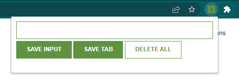

# Save Links // Tabs Chrome Extension

### Screenshot

## [live website](https://izkeer.github.io/ChromeExtension/)
## My process

This is a "following along" tutorial by Scrimba Javascript course.
In this course it was teached things like creating a localStorage to store the saved links.
Also how to use an API, in this case it was used google Tab API to save the current tab into the extension

### How the project works

So, this extension works like the favorite tabs saver. You can insert a link manually or you can browse through the tabs and save the current tab you're active by clicking in the "save tab button" 
you can also delete ALL the saved links by double clicking the "delete all" button.

### Built with

- Javascript
- Semantic HTML5
- CSS

